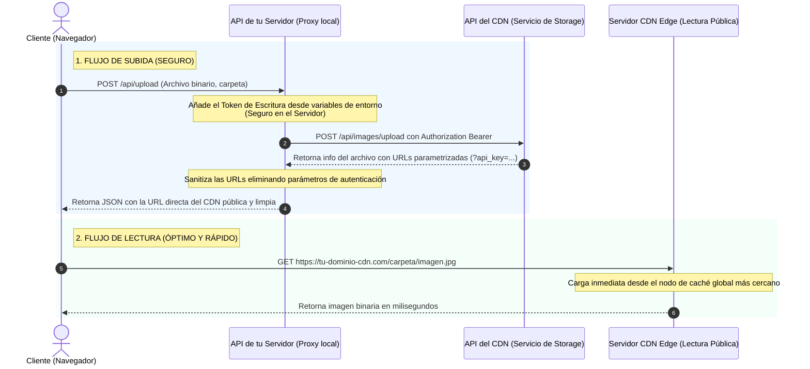

# Guía de Integración General: Conexión Segura a un CDN de Imágenes

Esta guía detalla cómo conectar cualquier aplicación web a un servicio de almacenamiento y distribución de imágenes (CDN) utilizando el **patrón de proxy en el servidor (Server-Side Proxy)**. Este patrón asegura que las credenciales de escritura permanezcan secretas en el servidor y nunca se expongan al navegador del cliente.

---

## 1. Arquitectura del Flujo de Datos

El flujo está diseñado para optimizar tanto la **seguridad al subir archivos** como la **velocidad al visualizarlos**.



---

## 2. Instrucciones de Conexión Paso a Paso

### Paso 1: Configurar las Variables de Entorno (`.env`)
En el entorno de tu servidor (backend), define las siguientes variables. Recuerda que los tokens de escritura **nunca** deben incluirse en el código del cliente (frontend).

```env
# URL de la API del CDN para subir archivos
CDN_API_UPLOAD_URL=https://api.tu-servicio-cdn.com/api/images/upload

# URL base pública desde la cual se leen los archivos
CDN_BASE_URL=https://cdn.diabolicalservices.tech

# Token secreto de escritura para autorizar las cargas
CDN_UPLOAD_TOKEN=tu_token_secreto_de_escritura_aqui
```

---

### Paso 2: Crear el Endpoint Proxy en tu Servidor

Este endpoint recibirá el archivo enviado por el frontend, le agregará las credenciales del servidor, lo enviará al CDN y devolverá una URL limpia.

#### Opción A: Implementación en Next.js (App Router)
Crea un archivo en tu ruta de API (por ejemplo, `app/api/upload/route.js` o `app/api/upload/route.ts`):

```javascript
import { NextResponse } from 'next/server';

export async function POST(req) {
    try {
        const formData = await req.formData();
        const file = formData.get('file'); // El archivo enviado desde el cliente
        const folder = formData.get('folder') || 'general'; // Carpeta de destino

        if (!file) {
            return NextResponse.json({ error: 'No se proporcionó ningún archivo.' }, { status: 400 });
        }

        // 1. Crear el formulario para enviar al CDN
        const cdnFormData = new FormData();
        cdnFormData.append('images', file);
        cdnFormData.append('folder', folder);

        const uploadUrl = process.env.CDN_API_UPLOAD_URL;
        const token = process.env.CDN_UPLOAD_TOKEN;

        // 2. Realizar la petición de servidor a servidor usando el Token
        const response = await fetch(uploadUrl, {
            method: 'POST',
            headers: {
                'Authorization': `Bearer ${token}`
            },
            body: cdnFormData
        });

        if (!response.ok) {
            const errorText = await response.text();
            return NextResponse.json(
                { error: `Error en el CDN: ${response.status}`, details: errorText }, 
                { status: response.status }
            );
        }

        const data = await response.json();

        // 3. Sanitizar las URLs devueltas para eliminar tokens de acceso o llaves expuestas
        const cleanUrl = (url) => {
            if (!url) return '';
            try {
                const parsed = new URL(url);
                parsed.searchParams.delete('api_key');
                parsed.searchParams.delete('token');
                return parsed.toString();
            } catch {
                return url.split('?')[0]; // Limpieza simple en caso de fallback
            }
        };

        // Procesar los datos de respuesta
        if (data.uploaded && data.uploaded.length > 0) {
            data.uploaded = data.uploaded.map(item => ({
                ...item,
                url: cleanUrl(item.url || item.cdnUrl)
            }));
        }

        return NextResponse.json(data);
    } catch (error) {
        console.error('Error en el Proxy de Carga:', error);
        return NextResponse.json({ error: 'Internal Server Error' }, { status: 500 });
    }
}
```

#### Opción B: Implementación en Node.js (Express)
Si utilizas un servidor Express clásico, instala `multer` para procesar archivos y `form-data` / `node-fetch` para enviarlos:

```javascript
const express = require('express');
const multer = require('multer');
const fetch = require('node-fetch');
const FormData = require('form-data');

const router = express.Router();
const upload = multer(); // Configuración de multer en memoria

router.post('/api/upload', upload.single('file'), async (req, res) => {
    try {
        if (!req.file) {
            return res.status(400).json({ error: 'No se recibió ningún archivo.' });
        }

        // 1. Construir el formulario multipart
        const form = new FormData();
        form.append('images', req.file.buffer, {
            filename: req.file.originalname,
            contentType: req.file.mimetype,
        });
        form.append('folder', req.body.folder || 'general');

        const uploadUrl = process.env.CDN_API_UPLOAD_URL;
        const token = process.env.CDN_UPLOAD_TOKEN;

        // 2. Enviar los datos del servidor al CDN
        const response = await fetch(uploadUrl, {
            method: 'POST',
            headers: {
                'Authorization': `Bearer ${token}`,
                ...form.getHeaders() // Inyecta las cabeceras multipart necesarias
            },
            body: form
        });

        if (!response.ok) {
            return res.status(response.status).json({ error: 'La carga al CDN falló' });
        }

        const data = await response.json();
        
        // 3. Sanitizar URLs
        const cleanUploaded = (data.uploaded || []).map(item => {
            const rawUrl = item.url || item.cdnUrl || '';
            return {
                ...item,
                url: rawUrl.split('?')[0] // Remueve parámetros de autenticación
            };
        });

        return res.json({ success: true, uploaded: cleanUploaded });
    } catch (error) {
        console.error('Error en carga Express:', error);
        return res.status(500).json({ error: 'Internal Server Error' });
    }
});
```

---

### Paso 3: Crear la Función de Subida en el Frontend

En tu cliente web (React, Vue, o JavaScript de vainilla), consume tu endpoint Proxy local:

```javascript
/**
 * Envía una imagen al proxy local de tu servidor para ser subida de forma segura al CDN.
 * @param {File} file - Objeto del archivo seleccionado desde un input HTML.
 * @param {string} folderName - Carpeta destino en el CDN (ej: 'usuarios', 'productos').
 * @returns {Promise<string>} - URL pública y limpia de la imagen en el CDN.
 */
async function subirImagenAlCDN(file, folderName = 'general') {
    const formData = new FormData();
    formData.append('file', file);
    formData.append('folder', folderName);

    // Llama al proxy seguro de tu propio servidor (Paso 2)
    const response = await fetch('/api/upload', {
        method: 'POST',
        body: formData
    });

    if (!response.ok) {
        throw new Error('Error al subir la imagen al servidor proxy.');
    }

    const data = await response.json();
    
    // Extraer la URL pública y sanitizada devuelta por el servidor
    if (data.uploaded && data.uploaded.length > 0) {
        return data.uploaded[0].url; 
    }
    
    throw new Error('Respuesta inválida del servidor proxy.');
}
```

#### Ejemplo de uso en un Input File:
```html
<input type="file" id="image-picker" accept="image/*" />

<script>
  document.getElementById('image-picker').addEventListener('change', async (event) => {
      const file = event.target.files[0];
      if (!file) return;

      try {
          console.log('Subiendo...');
          const cdnUrl = await subirImagenAlCDN(file, 'usuarios');
          console.log('¡Subida exitosa! URL del CDN:', cdnUrl);
          
          // Ahora puedes guardar esta URL limpia en tu base de datos
          // O asignarla al src de una etiqueta img:
          // document.getElementById('preview').src = cdnUrl;
      } catch (error) {
          console.error('Error durante la carga:', error.message);
      }
  });
</script>
```

---

## 3. Prácticas Recomendadas de Seguridad y Rendimiento

1. **Mantener Tokens de Escritura en el Servidor:** Jamás uses tokens del CDN en código frontend (como archivos `.env.local` en Next.js expuestos mediante prefijos como `NEXT_PUBLIC_`). El backend siempre debe ser la puerta de entrada para subidas.
2. **Utilizar Lectura Directa:** Al renderizar imágenes en la interfaz, apunta siempre el atributo `src` de las imágenes directamente a la URL pública del CDN (ej. `https://cdn.tu-dominio-cdn.com/...`). No pases la lectura a través de tu proxy, ya que el CDN cuenta con una red global optimizada para servir archivos estáticos con latencia ultrabaja.
3. **Establecer Caching Inmutable:** Configura el CDN o tu servidor proxy de entrega para devolver cabeceras de caché sólidas, por ejemplo:
   `Cache-Control: public, max-age=31536000, immutable`
   Esto le indica al navegador del cliente que almacene en caché local de forma permanente la imagen, evitando peticiones de red redundantes.
4. **Sanitización Obligatoria:** Asegura que cualquier función que procese URLs de respuesta limpie las llaves mediante URL Parsing o funciones string simples (como `.split('?')[0]`). Esto evitará fugas accidentales de parámetros query con llaves de acceso en tu base de datos o logs públicos.
